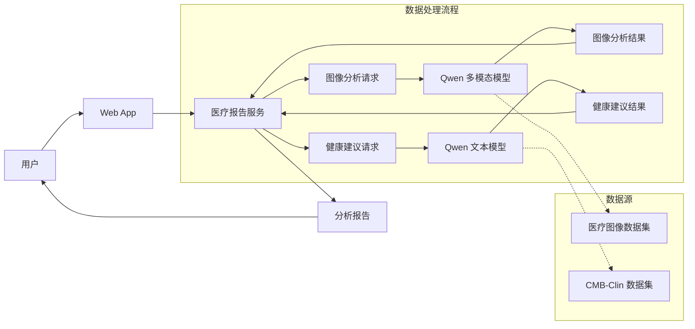

# LLM 微调实战项目：私人健康管家

## 项目概述

本项目是 LLM 微调课程的实战课程，选用 Qwen3.5-4B 作为基座模型，通过 LoRA 训练医学问答模型和医学报告图像理解模型，最终实现解读医学检测报告并提供专业的健康建议。




## 技术栈

- **基座模型**: Qwen3.5-4B
- **微调框架**: Unsloth
- **推理引擎**: vLLM
- **服务框架**: FastAPI
- **评估工具**: EvalScope
- **前端**: 原生 HTML/CSS/JavaScript


## 目录结构

```
fine-tuning-project2-v3/
├── day1/                          # Day 1: 模型训练与评估
│   ├── 1-prototype-image/         # 原型设计截图
│   ├── 2-prepare-dataset/        # 数据集准备
│   │   ├── prepare_dataset.py    # 原始数据集处理
│   │   ├── convert_to_evalscope_format.py
│   │   └── split_dataset.py      # 数据集划分
│   ├── 3-eval-llm/               # LLM 模型评估
│   │   ├── 1-eval/               # EvalScope 评估
│   │   ├── 2-vllm/               # vLLM 推理服务
│   │   └── 3-app/                # 评估结果查看
│   ├── 4-train-llm/              # LLM 微调训练
│   ├── 5-train-vl/               # VL 多模态微调训练
│   └── 6-vllm-vl/                # VL 模型验证
│
└── day2/                          # Day 2: 服务部署与应用
    ├── 1-launch-vllm/            # vLLM 服务启动脚本
    ├── 2-validation/             # 模型验证
    │   └── test-img/             # 测试图像
    └── 3-service/                # 医学检测报告解读服务
        ├── v1/                   # 基础文件上传版本
        ├── v2/                   # Base64 图像传输版本
        ├── v3/                   # vLLM 集成版本
        └── v4/                   # 完整 Web UI 版本
```

## 核心功能

### 1. 医学报告图像分析 (VL 模型)

输入医学检测报告图像，自动识别异常指标：

```
输入: 医学检测报告图片
    │
    ▼
VL 模型分析图像
    │
    ▼
输出: "检测到以下异常指标：..." 
```

### 2. 健康问答 (LLM 模型)

基于医学知识库回答健康相关问题：

```
输入: "我肚子疼是怎么回事？"
    │
    ▼
LLM 健康顾问
    │
    ▼
输出: "根据您描述的症状，可能的原因包括..."
```

### 3. 完整分析流程

结合 VL 和 LLM 模型，提供完整的健康分析服务：

1. 用户上传医学报告图片
2. VL 模型识别异常指标
3. LLM 基于异常指标生成健康建议
4. 返回完整的分析报告


## 注意事项

- 本项目为编程学习练习，输出内容仅为演示API调用流程，不具备任何医学参考价值
- 模型输出可能存在错误、偏差或完全不相关的内容，切勿根据模型输出做出任何实际健康判断或决策

